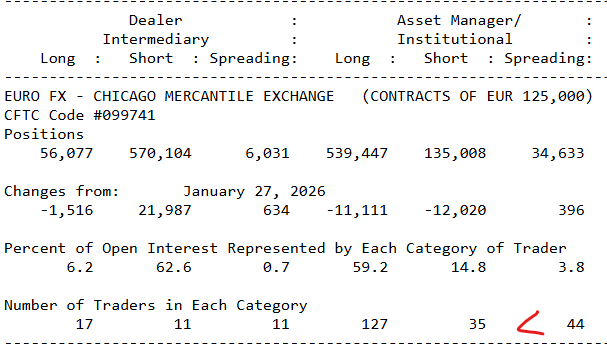

### What **Spreading** means in COT

**Spreading = traders holding both long *and* short positions in the same market**, usually to profit from **price differences**, not outright direction.

> **Spreading = long and short positions held by the same trader**

So they’re **not bullish or bearish** — they’re neutral on direction.

### Common types of spreads

* **Calendar spreads**
  Long one contract month, short another (e.g. long June crude, short December crude)
* **Inter-commodity spreads**
  Long one market, short a related one (e.g. long Brent, short WTI)
* **Quality/location spreads**
  Different grades or delivery points

### Why it shows up in COT

In COT reports, a **spreading position is reported separately** from outright longs and shorts because:

* Risk is lower than directional bets
* It’s usually done by **professionals**
* It tells you about **structure**, not sentiment

### How to interpret it

* **High spreading** → lots of relative-value / hedging activity
* **Rising spreading** → market structure changing (seasonality, storage, roll pressure)
* **Low spreading** → more pure directional trading

### Important trading takeaway

* **Ignore spreading for directional bias**
* Focus on **net longs vs net shorts**
* Use spreading mainly to understand **market maturity and liquidity**

### Which traders spread the most?

* **Commercials** (hedgers)
* **Managed Money / Leveraged Funds** doing relative-value trades
* Large institutions rolling positions

If you want, I can show you **how to adjust net positions when spreading explodes** or **when spreading signals a coming volatility shift** — just tell me what you’re trading.

> - - 

Perfect 👍 let’s make it **practical**.

Below is **how to use spreading + Managed Money / Leveraged Funds to spot reversals and trend strength**.

---

## 1️⃣ Ignore spreading for direction — but watch it for **timing**

Spreading is **neutral**, but **changes in spreading** matter.

### 🔹 Rule

* **Rising spreading + flat price** → big move loading
* **Falling spreading + trend slowing** → trend exhaustion

Think of spreading as **pressure building or releasing**.

---

## 2️⃣ Managed Money + spreading = reversal signal

### 📉 Bullish reversal setup

* Managed Money is **extremely net short**
* Price stops making lower lows
* **Spreading starts to decline**

➡️ Funds are **unwinding relative-value trades**
➡️ Directional longs often follow
➡️ **High-probability bottom**

### 📈 Bearish reversal setup

* Managed Money **extremely net long**
* Price stalls near highs
* **Spreading drops**

➡️ Smart money is exiting structure
➡️ Directional selling often follows

---

## 3️⃣ Trend confirmation (this is huge)

### 🔥 Strong trend

* Managed Money net position **expanding**
* **Spreading stable or rising**
* Price respects trend structure

➡️ Trend is **healthy**, not crowded yet

### ⚠️ Weak / late trend

* Managed Money stops adding
* **Spreading collapses**
* Price goes sideways

➡️ Expect **range or reversal**

---

## 4️⃣ When spreading spikes suddenly

This often means:

* Contract roll
* Seasonal hedging
* Storage or carry trade

### Trading rule

❌ Don’t fade price just because COT looks “extreme”
✅ Wait for **spreading to roll over**

---

## 5️⃣ Simple checklist you can use every week

Ask yourself:

* Are funds **adding or reducing** net exposure?
* Is spreading **rising, flat, or falling**?
* Is price **confirming or diverging**?

If **funds extreme + spreading falling + price divergence**
→ that’s your **A+ reversal zone**

---
> **real proof that spreading positions (long + short by same trader) are not included in pure long or short positions**

